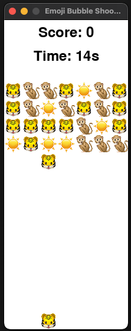

# Emoji Bubble Shooter Game
"A journey of a thousand emojis begins with a single emoji."

## Description
This is a simple bubble shooter game with emojis. Move around your shooter at the bottom and shoot emojis to make patterns of 5. The more emojis you shoot, the more points you get. The game ends when existing emojis hit the bottom of the screen.

## How to play
- Move the shooter with (A) and (D)
- Shoot with the space bar
- Shoot emojis to make patterns of 5 (vertically or horizontally)
- Read the story it tells you in console

## How to run
- Clone the repository
- Run `pip install -r requirements.txt` from the main directory
- Create a .env file in the main dir and add your OpenAI API Key
- Go into the src folder and run `python3 main.py`

## Deets
Speedran this and GPT-4 wrote most of the code (thank you ai friend).